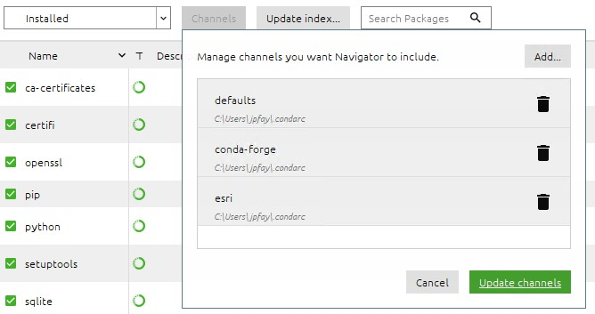

1. Navigate to https://anaconda.com

2. Download Python 3.7 version, 64-bit

3. Install

   1. Just for me
   2. Unselect both "Add Anaconda to my PATH" and "Register Anaconda as my default"

4. Open Anaconda Navigator (GUI for installing Python packages)

   1. Select `Environments`, on left panel

   2. Click `Create`, at bottom

      1. Name = `os_gis`
      2. Packages = Python 3.7

      And wait for environment to be created. The "os_gis" environment should now be active (below "base (root)").

   3. Install packages...

      1. Click the Channels button, then Add...

      2. Add `conda-forge` and `esri`

         

      3. Click update channels.

   4. Install the following packages by typing them in 

