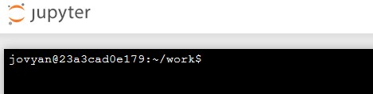

# GIS Practicum: Fetching data with Python

## Introduction

In a previous session, we examined a number of datasets in ArcGIS Pro. We discovered and obtained these datasets a number of ways: direct download from a web link, via ArcGIS online Portal searches, and by linking ArcGIS Online services.  Here, we examine how a similar process is done via Python. Our objects in doing so are threefold:

1. Give us more experience learning and using Python as well as with spatial data formats. 
2. Obtain the data we need for later analysis in Python.
3. Begin learning spatial data constructs and how they are used in a coding environment.


## Getting started

We'll again use Jupyter Notebooks hosted on the Duke `ENVIRON859` virtual environment. However to access the notebook exercises for this session we'll "clone" them from a GitHub repository. Doing so will require typing in a few simple commands in a Unix BASH command line. Sounds scary, but it's not. Here are the steps we'll follow:

1. Open your `Environ859` virtual environment: https://vm-manage.oit.duke.edu/containers/environ859
   This will bring you to the familiar Jupyter Dashboard we used in the last assignment. 

2. Using the `New▼` menu, create a new **Terminal**. This will open a new web page with a Unix terminal awaiting your command. 
   

3. At the terminal, type the following command:

   ```
   git clone https://github.com/DataDevils/FetchingData.git
   ```

4. To close your terminal, just type `exit` and then close the window. 

This should have downloaded a new folder called `FetchingData` to your Jupyter environment. These are the notebooks we will use for this exercise. 


