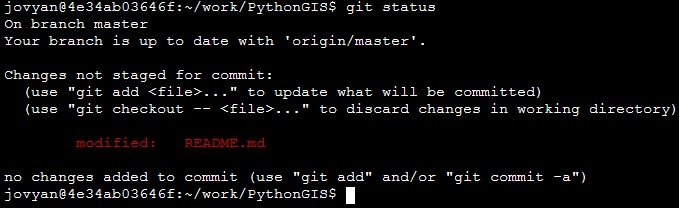
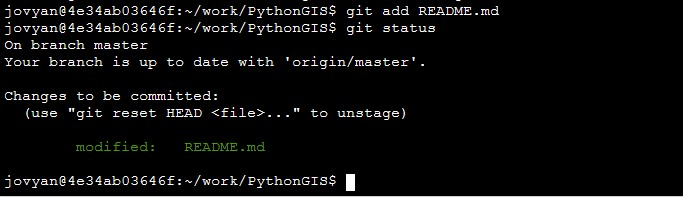
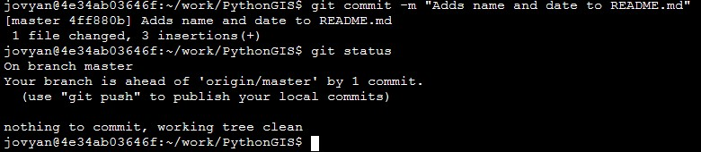
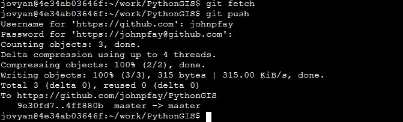

# GIS Practicum (Energy): *"Learning GIS - an Overview"*

> Fresh off our first exposure to Python, we now drill into how Python can be used to perform spatial analysis. We again leverage materials from an excellent resource, namely the [University of Helsinki's Automating GIS Processes tutorial](https://automating-gis-processes.github.io/site/index.html). Here I outline how we will adapt those materials to our own learning objectives. 


## Course environment

Continuing with the *Dive into Python* section we just completed, we will perform all our analysis using **Jupyter Notebooks** via Duke's [Virtual Manager](https://vm-manage.oit.duke.edu/containers).

* Navigate to the [Virtual Manager](https://vm-manage.oit.duke.edu/containers) web site.
* Select [ENVIRON859](https://vm-manage.oit.duke.edu/containers/environ859) to log into your virtual environment.

This should bring you to your Jupyter dashboard, listing all your existing Jupyter notebooks and other files. 


## Course materials

> Rather than upload Jupyter notebook files individually, we will pull a set of lesson notebooks into our remote environment using **Git** and **GitHub**. Instructions for doing that are listed below. This will allow you to retain your work as well as start using Git/GitHub, which is quite useful if continue on in the coding world.

### Setting up GitHub and Git: How it works

#### 1. "Forking" the class *PythonGIS* repository to your own account

> Forking a GitHub repository makes a copy of that repository in your own GitHub account. However, this copy retains a link to the original, or "upstream" repository such that if it changes, you can update your copy to include those changes. Otherwise, your "forked" repository will only track and store changes that you yourself make to files in that "forked repository".
>
> Here we will fork the main `PythonGIS` repository located within the `DataDevils` GitHub account. 

* Log in to your personal GitHub account. If you don't yet have a GitHub account, navigate to https://github.com and create one. 
* Navigate to https://github.com/DataDevils/PythonGIS and click the `Fork` button. This makes a copy of the class materials, stored in your personal GitHub repository. The browser should refresh to take you to the repository web page on your GitHub account. 


#### 2. Setting up your Jupyter environment for using Git

* Navigate back to your Jupyter dashboard. From the `New ▼` dropdown menu, select `Terminal` .

* At this terminal, we'll type commands to link our GitHub account with our ENV859 virtual environment. At the prompt, type the following commands ==replacing `my_user_name` with your own GitHub username and `me@email.com` with the email associated with your GitHub account==.

  ```bash
  git config --global user.name my_user_name
  git config --global user.email me@email.com
  ```


#### 3. "Cloning" your *PythonGIS* repository to your ENVIRON859 environment**

* First you need to copy the URL associated with your forked GitHub repository, e.g. "https://github.com/johnpfay/PythonGIS"

* Then, back in the terminal window, type the following command - ==using the URL associated with your repository==.

  ```bash
  git clone https://github.com/<your_github_username/PythonGIS
  ```

* If you navigate back to your Jupyter dashboard, you should see a new folder appear called "PythonGIS". 

1. **"Staging", "committing" and "pushing" changes to files in your repository**

   * Edit your **README.md** file by opening it via your Jupyter dashboard and adding your name and the date at the bottom. Save and close the file. 

   * Navigate to your terminal and change your active directory to your repository directory by typing the following command:

     ```bash
     cd PythonGIS
     ```

     →<u>Note</u>: if the above fails, try the same command used with the absolute path: `cd ~/work/PythonGIS`

   * Now, we'll check the status of our Git repository:

     ```bash
     git status
     ```

     

     > The `git status` command compares files in our local folder to the registry of files in our repository. By editing our README.md file, the file is now different than the one included in the registry. What we want to do next is to **stage** these changes.  

   * Next, we'll "add" the changed Readme.md file to our staging location. Then we'll examine the status.

     ```
     git add README.md
     git status
     ```

     

     > The `git add` command "stages" our changes, meaning Git is now paying attention to changes, incremental changes, such that we can roll back some or all of these changes. Staging can be somewhat nuanced and confusing at first; for now just accept that this step is necessary before the next step which is to **commit** our changes to the repository. 

   *  Next, we'll "commit" the local changes we made to the repository, associating the change with a brief message.

     ```
     git commit -m "Adds name and date to README.md"
     git status
     ```

     

     > The `git commit` command logs changes to our staged files into the repository's registry, with the logged entry associated with the message we provide and a unique log id (called a SHA, pronounced "shah"). 
     >
     > → You can type the command `git log` or `git log --oneline` to review your commit history. 
     >
     > The remaining step is to synchronize changes to our local repository, the one we cloned to our ENVIRON859 environment, to our remote  repository located on the GitHub cloud. This is done by first **fetching** any changes to the remote repository (done to identify any conflicts), and then **push** our changes to the remote repository.

   * And finally, we'll push our changes to the remote repository, i.e. the one on the GitHub cloud. (As this is likely the first time you've pushed a commit to your GitHub repository, you'll likely be asked for your GitHub username and password...)

     ```bash
     git fetch 
     git push
     ```

     

     > The `git push` command synchronized your local repository (and its registry) with your cloud-based remote repository. After this step, you can go to your GitHub page and you should see your changes to the README.md file.

     

     It may take some time to get comfortable with Git and GitHub, but it's a useful tool to learn. Our use of Git & GitHub will only use a small portion of its overall capability, but I will allude to other useful features as the class progresses. For now, we've used it primarily to get a copy of the materials we'll use to learn Python & GIS, and we'll review steps to maintain this repository later. 

     For more information on Git and GitHub refer to this page: https://geo-python.github.io/site/lessons/L2/git-basics.html


### Course format

With our material now copied to our ENVIRON859 environment, we'll now embark on the material, which again will follow the Automating GIS Processes site. That site includes a set of learning goals, listed [here](https://automating-gis-processes.github.io/site/course-info/learning-goals.html):

| Week | Learning goals                                               |
| :--: | ------------------------------------------------------------ |
|  1.  | <u>**Shapely and geometric objects (points, lines and polygons)**</u><br />• Have an idea of what kind of tools are available for doing GIS in Python <br />• Understand what kind of geometric objects are available and what they are <br />• Know how to create different kind of geometries using Shapely <br />• Know how to read coordinates from a file and create Points based on those |
|  2.  | <u>**Managing spatial data with Geopandas (reading and writing data, projections, table joins)**</u><br />• Read and write spatial data from/to common file formats <br />• Manage spatial data using Geopandas <br />• Re-project a geodatafame from one projection to another |
|  3.  | **<u>Geocoding and spatial queries</u>**<br />• Do geocoding, i.e. converting addresses into Points (and vice versa)<br />• Conduct Point in Polygon queries Read data from KML file<br />• Make spatial and table joins between layers <br />• Find the nearest neighbor from Point -objects |
|  4.  | **<u>Reclassifying data, overlay analysis</u>**<br />• Reclassify data based on different criteria (custom or common classifiers) <br />• Do overlay analysis & select data e.g. based on boundaries of another layer <br />• Aggregate data & merge geometric objects together, based on common id <br />• Simplify geometries |
|  5.  | <u>**Visualization: static and interactive maps**</u><br />• Create a static map with background basemap using Geopandas & contextily <br />• Create a simple interactive map using either Bokeh or Folium (or both) <br />• Share your maps (static / interactive) on the internet using GitHub pages |
|  6.  | **<u>OpenStreetMap data (osmnx) and Network analysis (networkx)</u>**<br />• Retrieve and save data from OpenStreetMap using Python <br />• Extract simple street network properties and statistics <br />• Do simple route optimization using shortest path algorithm in osmnx / networkx |
|  7.  | **<u>Using Python in QGIS; Raster data processing</u>**<br />• Understand the basics of raster data processing using rasterio<br />• Be familiar with Python scripting in QGIS |


