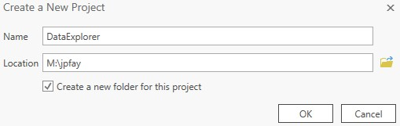

# GIS Practicum (Energy): *Data Exploration with ArcGIS Pro*

## Overview and objectives:

In this exercise we'll introduce ourselves to ArcGIS Pro - the industry standard GIS application - and use it to explore various spatial datasets that might be useful in our analysis. In addition to a quick tour of the ArcGIS Pro (or "ArcPro") software, we'll cover topics such as creating a proper workspace structure for GIS analyses, the various types and formats of spatial data, and tips for finding, acquiring, and managing spatial datasets. 

→ For this exercise, we'll use NSOE lab machines with our class drives mapped. (Recall the <A HREF="./login_790.bat" download>login_790.bat</A> script we created...) 

I realize we'll be packing in a lot, so don't worry if some key points don't lodge in your head the first time hearing them. My intentions are to record this lesson so that you can go back to the class recording and review anything you want. 

---

## ArcGIS Pro Set up

### 1. Opening ArcGIS Pro

*When you first start ArcGIS Pro, you'll be asked to sign in. This step both checks out an ArcGIS Pro license and links the software to your ArcGIS Online account.* 

* Find and click the ArcGIS Pro icon in your Windows Start menu.
* Click the `Enterprise login` option. 
* In the Enterprise login window, enter `nsoe.maps.arcgis.com`, as that is the URL of our ArcGIS Online Portal. Click `continue`.
* Enter your AGOL username (`<netID>_790`) and password. 
* When complete, the ArcGIS Pro screen should appear asking you to open a recent project or create a new one...

*Each time you use a new NSOE machine and create a new ArcGIS Pro session, you may need to go through this process.* 

> This will associate ArcGIS Pro with your <u>NSOE</u> AGOL account. Alternatively, you can sign into your <u>Duke</u> AGOL account by entering  `dukeuniv.maps.arcgis.com` as your Enterprise URL and then use your NetID and password to log in. 

### 2. Creating a new ArcGIS Pro project & workspace

ArcGIS Pro is project based meaning you create a workspace for each GIS project you tackle. This workspace will hold all the data, tools, and the project file itself. You initialize your project workspace first by selecting a template (any will be fine for now), and then creating a project folder. 

* Select `Map` from the New Blank Templates options. 

* Name your new project "`DataExplorer`" and place it in your `M:\<netID>` drive (or whatever you've selected as your mapped class drive). Keep the "Create new folder" option checked. 

  

  If you navigate to your `M:\<netID>` folder (same as your`P:` drive), you'll now see a folder called `DataExploration` . This is our <u>**Project Root Folder**</u> and will contain everything related to our project. Within it you'll see a few new folders and files saved there. 

  > * The `DataExplorer.aprx` file is the ArcGIS Pro project file. 
  > * The `DataExplorer.tbx` file is the ArcGIS Pro toolbox file, which will hold any models you create.
  > * The `DataExplorer.gdb` is an ArcGIS File Geodatabase, used to store spatial data.
  > * The `ImportLog` and `Index` folders are for internal record keeping. 
  >
  > \* **→ It's best not to touch any of the files in the `DataExplorer.gdb`, `ImportLog`, and `Index` folders...**

We'll want to create a few new folders in our Project folder, these are a `data` folder used to store data for our project, and a `scratch` folder to hold the gobs of intermediate or temporary files we are likely to make in our analyses. 

* In Windows, navigate to your Project Root Folder (`P:\DataExplorer`) and create a new subfolder called `data`. 
* Likewise, create another new folder called `scratch`.

In the end your workspace should look like this: 

We are now ready to start adding and viewing data. 

---

## Getting data, data formats, and interacting with data

We'll now grab some datasets to view in ArcGIS Pro. We'll start with those mentioned by Luke Hellgren from MJB&A. 

* Open up the [MJB&A slide deck](./Materials/MJB&A EV Location Tools [Nicholas School Presentation] 2020-02-06.pdf) and navigate to slide 6. 
* Click on the link for [Federal Highway Administration (FHWA)Highway Performance Monitoring System](https://www.fhwa.dot.gov/policyinformation/hpms/shapefiles.cfm).
  * In the download page, select `2017` and `North Carolina`. Save the resulting zip file to your `data` folder created above.
  * Unzip the file. *it's contents are a **Shapefile**, which is a single GIS **feature class** stored across multiple files.* 
* In ArcGIS Pro, on the left side is the `Catalog Pane` which lists various items you can access. Locate the `Folders` selection and within that, you'll see your `DataExplorer` folder, the `data` folder within that, and the `NorthCarolina2017.shp` shapefile within that. (If not, try right-clicking on the `data` folder and select `Refresh`).
  * Click and drag the `NorthCarolina2017.shp` file onto your Map.
* Play around with your map. 
  * Click and drag to move around. 
  * Use the mouse wheel to zoom in and out. 
  * On the left hand side is the Table of Contents: Turn various layers on and off. 
* Zoom in and click on a feature in the roads dataset. This opens up a window showing the <u>**attributes**</u> for that feature. What is the *Route_Name* of the feature you selected? To find out what these attributes mean, we look at the **<u>metadata</u>** associated with the dataset, for which Luke kindly provide a [link](https://www.fhwa.dot.gov/policyinformation/tables/performancenetwork/) in his presentation. 

> We will review a number of other ways you can interact with these data in class...

### Other web dataset to explore:

#### ♦ NC-DOT

* Google `NC DOT GIS data`. Explore your results, looking for downloadable GIS files.
* Download some files, e.g. the ones [here](https://connect.ncdot.gov/resources/State-Mapping/Pages/Traffic-Survey-GIS-Data.aspx).
  * TIP: You may want to organize your downloads into separate folders named by source, e.g. NC_DOT.
  * TIP: You may also want to save the links from where you got these data in the same folder as the downloaded files. 
  * TIP: It'd likely be useful to also download any metadata files associated with these datasets. 
* Explore these files in ArcGIS Pro.

#### ♦ Homeland Infrastructure Foundation-Level Data

* Navigate to: https://hifld-geoplatform.opendata.arcgis.com/

 * Search for data that might be relevant:
   	* Note you can filter the results, e.g. Content type = "Feature Layer"
      	* Did you find [Transmission Lines](https://hifld-geoplatform.opendata.arcgis.com/datasets/electric-power-transmission-lines)? Power substations? 

* Download the data as in ***File Geodatabase*** format (to explore this format vs shapefile).
* Explore the data in ArcGIS Pro.

## ArcGIS Online Datasets

*More and more data are being stored in formats directly accessible by ArcGIS Pro (vs having to download and open).* 

#### ►Searching for data using the ArcGIS Online Portal

* In ArcGIS Pro's Catalog Pane, select the Portal tab, then select the "All Portal" icon (the basic cloud icon:  :cloud: ). This allows you to search a vast collection of datasets. 
* In the search box, enter `ev charging`.  Hover over the results for more info on each. 
  * Refine your search with more keywords: `ev charging NC` 
  * Refine your search for just feature layer data: `ev charging type:feature`
  * Drag results onto your map to view them.
* You can also perform these searching within ArcGIS Online...

#### ►Searching for data using ESRI's Living Atlas

* Now switch to from "All Portal" to the cloud icon with a small green book - **ESRI's Living Atlas**. 
  * Filter your results, setting the category to Utilities and then entering `transmission type:feature` in the search term.
  * Find and add the "Electric Power Transmission Lines" to your map.
* A fuller description of the Living Atlas is here: https://livingatlas.arcgis.com/en/ 

#### ►Some useful techniques for finding online data...

* Open MJB&A's online tool: https://mjb-a.maps.arcgis.com/apps/webappviewer/index.html?id=06a73cb31d014f4f8270a6c74a576fc4
  * Note the URL: it has `arcgis.com` in the name. Hmm...
* Open up your ArcGIS Online web site: https://nsoe.maps.arcgis.com
* Search AGOL for the sites ID value: `06a73cb31d014f4f8270a6c74a576fc4`
  * You may have to toggle the button to search outside the NSOE portal..
  * You'll see the result is  a Web Mapping Application owned by `lukehellgren1` !
  * Let's see what else Luke has...
* Back in ArcGIS Pro, in your Portal search box, enter: `NC owner:lukehellgren1 type:feature`
  * Add some the results to your map and explore them...

* Search ArcGIS Portal for `gas station NC`
  * Add the one owned by *nconemap* to your map (add `owner:nconemap` to your search if you fail to find it.
* Open up the Layers properties (right click it in the Map's table of contents and select Properties)...
* Select the `Source` tab on the left. On the right, you'll see a URL...
* Open this [URL](https://services.nconemap.gov/secure/rest/services/NC1Map_Energy/MapServer) in your browser...
* At the top of the web site (called an ESRI REST endpoint) you'll find the path leading to this service. Click the [services](https://services.nconemap.gov/secure/rest/services) link...
* This reveals many other services hosted by the same server; you might find other useful datasets there. 

---

## Assignment: 

#### 1.Explore and add some datasets to your map that may be useful. 

You are welcome to use the sites below or find your own.

* US DOT: https://data-usdot.opendata.arcgis.com/
* NC DOT: https://ncdot.maps.arcgis.com/home/index.html
* NC OneMap: https://www.nconemap.gov/

#### 2. Outline some analyses that might help in siting potential EV charging sites.

Let the data we downloaded inspire you and just jot down what you might want to calculate. For example:

* Find the distance between `X` and `Y`
* Find the number of `X` that fall within `Y` km of `Z`

